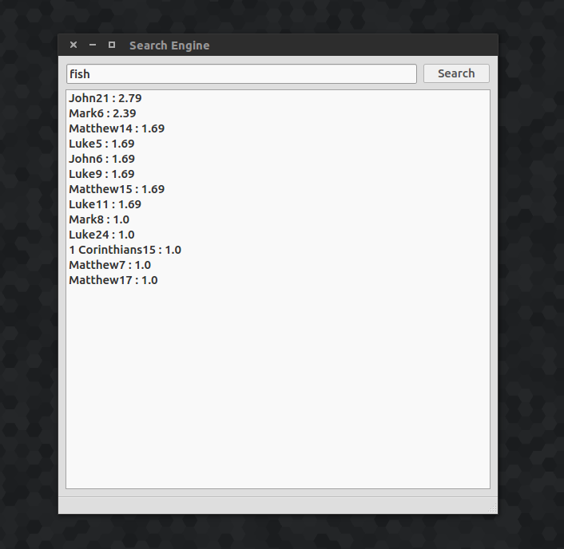

# Inverted index

## Theory

An inverted index is a data structure that indicates which documents contain a given word. In other words the inverted index contains the frequencies of each words in each document.

The first step is to index a collection of documents to build the inverted index. Once the inverted index is stored, queries can be parsed and compared to each document to return pertinent results.

In this case I simply computed the base logarithm of the summed up frequencies of each word of the query. However more sophisticated models exist (this wasn't the point of this project). Check out the [Perl search engine](https://github.com/MaxHalford/Wikisid) I coded for more advanced scoring methods.

## Database

The inverted indexs are stored as JSON files with MongoDB. Sadly if you want this run you will have to install MongoDB on your computer. You don't have to know *anything* about MongoDB to run this yourself. However if you are interested in MongoDB please check out the [IPython notebook tutorial](http://maxhalford.com/resources/notebooks/genetic-algorithms) I wrote.

## Interface

For the interface I used Qt. There is a very useful tool called QtDesigner where you can design your interface with a point-and-click interface. Once saved this produces a .ui file which you can convert to python with the ``uiToPython.sh`` script. This produces a python file which contains a class (normally called ``Ui_MainWindow``) with which you will have to work. The philosophy is that you connect interfaces actions (button clicks, scrolling, etc.) with python function.

## Example

As an example I parsed the New Testament. The following image is a query example with the list of pertinent documents.

## Running it yourself

- Install MongoDB, Python3, Qt.
- Run ``Storage.py`` to store the files in ``data/New Testament`` in MongoDB.
- Run main.py.
- Profit!
>>>>>>> dcb01928e071379626fd6345f7d3128450edc979
